# Herschell Heat Panel Thermostat USB Power.
I have some [Herschel](https://www.herschel-infrared.co.uk/) infra red heat panels in my house. These are controlled via [Herschel T2 thermostatss](https://www.herschel-infrared.co.uk/product/iq-t2-wireless-thermostat-pack/). These thermostats work well and are battery powered. As eventually the batteries run out I thought it would be useful to provide a way to run
these thermostats from USB power. This project provides this functionality.

# Design
I chose to create a unit that plugged into the rear of the T2 thermostat battery compartment. This required the design of the 3D printed case to clip into the space where the batteries sit as shown below. I chose to use a panel mounted USB C connector and a DC-DC converter module to convert the 5V DC USB power to 3.3V to power the thermostat.

# T2 Thermostat

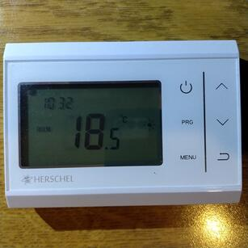 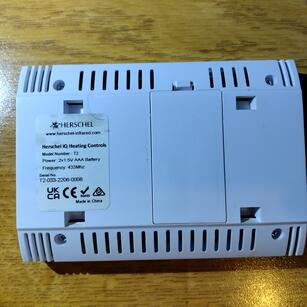

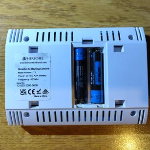 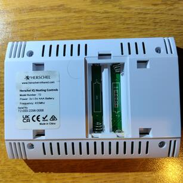

# USB Adaptor Parts

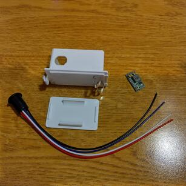

 - The case is 3D printed. The case folder contains the 3mf files that can were 3D printed using a bambulab X1C and H2D 3D printer.
 - The [battery clips](https://www.aliexpress.com/item/1005007626871404.html?spm=a2g0o.order_list.order_list_main.11.2a3418026V22Aa) are pushed into the two slots in the case.
 - The [DC-DC converter module](https://www.ebay.co.uk/itm/297769354538?_skw=DC-DC+Buck+Converter+Step+Down+Adjustable+Power+Module+12V+24V+to+5V+3.3V+New&itmmeta=01KBVV4NK9VA4E1KW17CB0GDES&hash=item45546fc52a:g:2i0AAeSwumFpGwI5&itmprp=enc%3AAQAKAAABEFkggFvd1GGDu0w3yXCmi1d0aL4lIbHVAukl7vM4W6zth6mhuzEFO2699sqJ%2Fk4R5MekLVG15sfpab2OHF9rg7Y8pbI%2Fm9CMYQg4pLhCVtQySiACfFhrctV%2FjyGafAaOvHdUQxGV1h7xoCrOJ7F%2BVfjLZ8%2FbudBiobDISNlt50%2BMrLfcdre3bbL6%2F8WBZhtcqChx7cwFZt0fzplVE%2BLiU0Q4CU%2FfRXHtpMyN8Nrj0wRVLc9fKO%2BBQIM6xFJU%2FNTt6K0OQqiGwjc%2BUml0AmOgQQL0NtQC37lpCMPa8grSA9Hq0oCwSy1DSxVoYZ46Cul9HVe9heD3OpbqJv%2BQL4vYGAz08s7tiPdcb%2BkPShmgO8%2Fd%7Ctkp%3ABk9SR-jZkvveZg) was set to provide 3.3V. This involves cutting a track and adding solder to the 3.3V pads.
 - The [USB C connector](https://www.amazon.co.uk/gp/product/B0CPLRH4W6/ref=ppx_yo_dt_b_search_asin_title?ie=UTF8&psc=1) had the two center wires (white and blue) removed before assembly.

# Assembly
The parts were assembled and connected as shown in the pictures below.

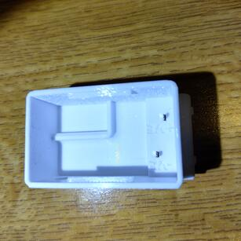

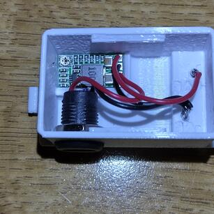

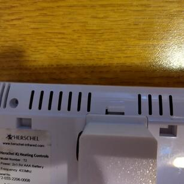

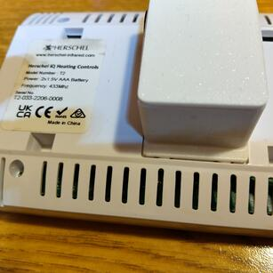

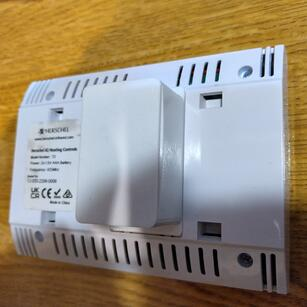

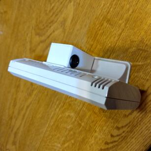

The +5V USB power was connected to the DC-DC converter module input and the +3.3v output was connected to the battery clip (+ve terminal) as shown in the above pictures.

The T2 thermostat can then be powered from a USB power supply or USB power bank.

# License
This project is licensed under the Creative Commons Attribution 4.0 International License (CC BY 4.0).
See the LICENSE file for details.
